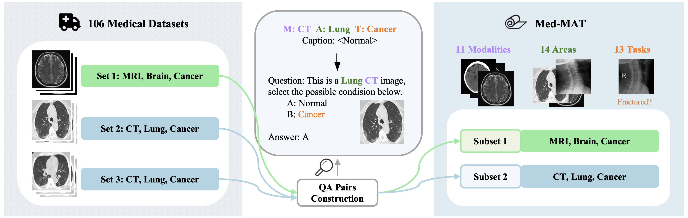

# [ACL 2025 Main] Med-MAT: Exploring Compositional Generalization of Multimodal LLMs for Medical Imaging

The definition of **MAT** states that all data in the dataset are organized according to their **M**odality, **A**natomical Area, and **T**ask. Additionally, MAT is designed to lay out like a mat, covering as many Modalities/Areas/Tasks as possible.

## ✨ Latest News
- [12/31/2024]: Release the paper [On the Compositional Generalization of Multimodal LLMs for Medical Imaging](https://arxiv.org/abs/2412.20070), in which we found that multimodal LLMs can use compositional generalization to understand unseen medical images.
- [12/27/2024]: Release the classification datasets in Med-MAT. The detection/segmentation datasets are coming soon.

## ⚡ Introduction
Welcome to the repository of Med-MAT, a VQA dataset consisting of 106 open-source medical datasets, which we hope will advance generalization experiments and aid in training powerful medical multimodal large language models (MLLMs)

Through this dataset, we have demonstrated that Compositional Generalization (CG) is one of the key mechanisms for MLLMs to understand unseen images, enabling them to handle unfamiliar images and achieve data-efficient training.

<div align=center>

</div>

Here is a list of what has been released:

1. **QA Pairs for 106 Medical Datasets**: Image-label pairs converted into VQA pairs for MLLM training.
2. **QA Pairs for 53 Aggregated Subsets**: Datasets categorized by **M**odality, **A**natomical Area, and **T**ask (MAT), with identical entries merged into subsets.
3. **Image Download Links**: Some datasets cannot be shared due to licensing. Users can download them to specified directories.


## 💭 QA Pairs Construction

To enable MLLMs to directly train and test on Med-MAT, the image-label pairs were converted into a Visual Question-Answering (VQA) format. The process involves the following steps:
1. **Task Definition**: Each subset was manually assigned 6 instructions to guide the MLLM in answering the task related to the subset.
2. **Conversion to VQA Format**: All image-label pairs were converted into single-choice questions with up to four answer options.
3. **Distractor Selection**: Distractor options were randomly drawn from other labels within the subset to ensure variety.
4. **Final Dataset**: The resulting dataset consisted of VQA pairs, where each image is paired with a question and four options, one of which is correct.


## 📚 Data

You can access the QA pairs of Med-MAT through [HF](https://huggingface.co/datasets/FreedomIntelligence/Med-MAT).

The tables below record the download URLs for the images and QA pairs for each dataset and subset. If you only wish to use part of Med-MAT, you can selectively download the corresponding data.

**Original_Medical_Datasets**
<details>
<summary>Click to view the details of 106 Medical Datasets</summary>

| **No.** | **Name with link** | **Modality** | **Area** | **Task** | **QA** |
| ------ | ------- | ------- | -------- | -------- | -------- |
| 1 |[Intel and MobileODT Cervical Screening](https://www.kaggle.com/competitions/intel-mobileodt-cervical-cancer-screening/data)|Co|Cervix|Cervix Type in Screening|[HF](https://huggingface.co/datasets/FreedomIntelligence/Med-MAT/blob/main/Original_Medical_Datasets/ori--01-train.json)|
| 2 |[CT Kindney Dataset](https://www.kaggle.com/datasets/nazmul0087/ct-kidney-dataset-normal-cyst-tumor-and-stone)|CT|Kidney|Normal or Cyst or Tumor|[HF](https://huggingface.co/datasets/FreedomIntelligence/Med-MAT/blob/main/Original_Medical_Datasets/ori--02-train.json)|
| 3 |[SARS-COV-2 Ct-Scan](https://www.kaggle.com/datasets/plameneduardo/sarscov2-ctscan-dataset)|CT|Lung|COVID19, Classification Dataset|[HF](https://huggingface.co/datasets/FreedomIntelligence/Med-MAT/blob/main/Original_Medical_Datasets/ori--03-train.json)|
| 4 |[COVID CT COVID-CT](https://tianchi.aliyun.com/dataset/106604)|CT|Lung|COVID19, Classification Dataset.|[HF](https://huggingface.co/datasets/FreedomIntelligence/Med-MAT/blob/main/Original_Medical_Datasets/ori--04-train.json)|
| 5 |[Chest CT-Scan](https://tianchi.aliyun.com/dataset/93929)|CT|Lung|Cancer, 3 Cancer Categories, Multiple Classification Dataset|[HF](https://huggingface.co/datasets/FreedomIntelligence/Med-MAT/blob/main/Original_Medical_Datasets/ori--05-train.json)|
| 6 |[COVID-19-CT SCAN IMAGES](https://tianchi.aliyun.com/dataset/93666)|CT|Lung|COVID19, Classification|[HF](https://huggingface.co/datasets/FreedomIntelligence/Med-MAT/blob/main/Original_Medical_Datasets/ori--06-train.json)|
| 7 |[Head CT](https://www.kaggle.com/datasets/felipekitamura/head-ct-hemorrhage?select=labels.csv)|CT|Brain|Head Hemorrhage|[HF](https://huggingface.co/datasets/FreedomIntelligence/Med-MAT/blob/main/Original_Medical_Datasets/ori--07-train.json)|
| 8 |[CT of Brain](https://www.kaggle.com/datasets/trainingdatapro/computed-tomography-ct-of-the-brain)|CT|Brain|Head Cancer|[HF](https://huggingface.co/datasets/FreedomIntelligence/Med-MAT/blob/main/Original_Medical_Datasets/ori--08-train.json)|
| 9 |[MED-NODE](https://www.cs.rug.nl/~imaging/databases/melanoma_naevi/)|Der|Skin|Melanoma or Naevus|[HF](https://huggingface.co/datasets/FreedomIntelligence/Med-MAT/blob/main/Original_Medical_Datasets/ori--09-train.json)|
| 10 |[ISIC 2020](https://challenge2020.isic-archive.com/)|Der|Skin|Melanoma, Benign or Malignant|[HF](https://huggingface.co/datasets/FreedomIntelligence/Med-MAT/blob/main/Original_Medical_Datasets/ori--10-train.json)|
| 11 |[PED-UFES-20](https://data.mendeley.com/datasets/zr7vgbcyr2/1)|Der|Skin|Skin Multi Classification|[HF](https://huggingface.co/datasets/FreedomIntelligence/Med-MAT/blob/main/Original_Medical_Datasets/ori--11-train.json)|
| 12 |[Web-scraped Skin Image](https://www.kaggle.com/datasets/arafathussain/monkeypox-skin-image-dataset-2022)|Der|Skin|Skin Desease Multi Classification|[HF](https://huggingface.co/datasets/FreedomIntelligence/Med-MAT/blob/main/Original_Medical_Datasets/ori--12-train.json)|
| 13 |[ISBI 2016](https://www.kaggle.com/datasets/angelachristabel/isbi-2016?select=Training_GroundTruth.csv)|Der|Skin|Skin Lesion Classification|[HF](https://huggingface.co/datasets/FreedomIntelligence/Med-MAT/blob/main/Original_Medical_Datasets/ori--13-train.json)|
| 14 |[ISIC 2019](https://www.kaggle.com/datasets/andrewmvd/isic-2019)|Der|Skin|Skin Desease Multi Classification|[HF](https://huggingface.co/datasets/FreedomIntelligence/Med-MAT/blob/main/Original_Medical_Datasets/ori--14-train.json)|
| 15 |[Skin Cancer ISIC](https://www.kaggle.com/datasets/nodoubttome/skin-cancer9-classesisic)|Der|Skin|Skin Cancer Multi Classification|[HF](https://huggingface.co/datasets/FreedomIntelligence/Med-MAT/blob/main/Original_Medical_Datasets/ori--15-train.json)|
| 16 |[Dental Condition Dataset](https://www.kaggle.com/datasets/salmansajid05/oral-diseases/data)|DP|Teeth|Teeth condition classification|[HF](https://huggingface.co/datasets/FreedomIntelligence/Med-MAT/blob/main/Original_Medical_Datasets/ori--16-train.json)|
| 17 |[Oral Cancer Dataset](https://www.kaggle.com/datasets/zaidpy/oral-cancer-dataset)|DP|Teeth|Oral cancer Classification|[HF](https://huggingface.co/datasets/FreedomIntelligence/Med-MAT/blob/main/Original_Medical_Datasets/ori--17-train.json)|
| 18 |[The Nerthus Dataset](https://datasets.simula.no/nerthus/)|End|Intestine|Cleanliness level|[HF](https://huggingface.co/datasets/FreedomIntelligence/Med-MAT/blob/main/Original_Medical_Datasets/ori--18-train.json)|
| 19 |[Endoscopic Bladder Tissue](https://commons.datacite.org/doi.org/10.5281/zenodo.7741475)|End|Bladder|Canser Degree Classification|[HF](https://huggingface.co/datasets/FreedomIntelligence/Med-MAT/blob/main/Original_Medical_Datasets/ori--19-train.json)|
| 20 |[Kvasir](https://www.kaggle.com/datasets/meetnagadia/kvasir-dataset)|End|Intestine|Multi Disease Classification|[HF](https://huggingface.co/datasets/FreedomIntelligence/Med-MAT/blob/main/Original_Medical_Datasets/ori--20-train.json)|
| 21 |[ACRIMA](https://figshare.com/s/c2d31f850af14c5b5232)|FP|Fundus|Glaucoma|[HF](https://huggingface.co/datasets/FreedomIntelligence/Med-MAT/blob/main/Original_Medical_Datasets/ori--21-train.json)|
| 22 |[Augemnted ocular diseases AOD](https://www.kaggle.com/datasets/nurmukhammed7/augemnted-ocular-diseases)|FP|Fundus|Multi Classification of eye diseases|[HF](https://huggingface.co/datasets/FreedomIntelligence/Med-MAT/blob/main/Original_Medical_Datasets/ori--22-train.json)|
| 23 |[JSIEC](https://www.kaggle.com/datasets/linchundan/fundusimage1000)|FP|Fundus|Multi Classification of eye diseases|[HF](https://huggingface.co/datasets/FreedomIntelligence/Med-MAT/blob/main/Original_Medical_Datasets/ori--23-train.json)|
| 24 |[Multi-Label Retinal Diseases](https://data.mendeley.com/datasets/pc4mb3h8hz/1)|FP|Fundus|Multi Classification of eye diseases|[HF](https://huggingface.co/datasets/FreedomIntelligence/Med-MAT/blob/main/Original_Medical_Datasets/ori--24-train.json)|
| 25 |[RFMiD 2.0](https://github.com/openmedlab/Awesome-Medical-Dataset/blob/main/resources/RFMiD.md)|FP|Fundus|Multi Classification of eye diseases|[HF](https://huggingface.co/datasets/FreedomIntelligence/Med-MAT/blob/main/Original_Medical_Datasets/ori--25-train.json)|
| 26 |[ToxoFundus(Data Processed Paper)](https://www.kaggle.com/datasets/nafin59/ocular-toxoplasmosis-fundus-images-dataset)|FP|Fundus|Ocular toxoplasmosis|[HF](https://huggingface.co/datasets/FreedomIntelligence/Med-MAT/blob/main/Original_Medical_Datasets/ori--26-train.json)|
| 27 |[ToxoFundus(Data Raw 6class All)](https://www.kaggle.com/datasets/nafin59/ocular-toxoplasmosis-fundus-images-dataset)|FP|Fundus|Ocular toxoplasmosis|[HF](https://huggingface.co/datasets/FreedomIntelligence/Med-MAT/blob/main/Original_Medical_Datasets/ori--27-train.json)|
| 28 |[Adam dataset](https://www.kaggle.com/datasets/xiaoliang2121/adamdataset)|FP|Fundus|Age-related Macular Degeneration|[HF](https://huggingface.co/datasets/FreedomIntelligence/Med-MAT/blob/main/Original_Medical_Datasets/ori--28-train.json)|
| 29 |[APTOS 2019 Blindness](https://www.kaggle.com/competitions/aptos2019-blindness-detection)|FP|Fundus|Blindness Level Identification 0~4|[HF](https://huggingface.co/datasets/FreedomIntelligence/Med-MAT/blob/main/Original_Medical_Datasets/ori--29-train.json)|
| 30 |[DRIMBD](https://www.kaggle.com/datasets/subhajournal/drimdb-diabetic-retinopathy-images-database)|FP|Fundus|Quality Testing of Retinal Images|[HF](https://huggingface.co/datasets/FreedomIntelligence/Med-MAT/blob/main/Original_Medical_Datasets/ori--30-train.json)|
| 31 |[Glaucoma Detection](https://www.kaggle.com/datasets/sshikamaru/glaucoma-detection)|FP|Fundus|Glaucoma Classification|[HF](https://huggingface.co/datasets/FreedomIntelligence/Med-MAT/blob/main/Original_Medical_Datasets/ori--31-train.json)|
| 32 |[AIROGS](https://zenodo.org/records/93241)|FP|Fundus|Glaucoma Classification|[HF](https://huggingface.co/datasets/FreedomIntelligence/Med-MAT/blob/main/Original_Medical_Datasets/ori--32-train.json)|
| 33 |[ICPR-HEp-2](https://github.com/KaikaiZhao/HEp-2_cell_classification)|Mic|Cell|Multi Classification|[HF](https://huggingface.co/datasets/FreedomIntelligence/Med-MAT/blob/main/Original_Medical_Datasets/ori--33-train.json)|
| 34 |[SICAPv2](https://data.mendeley.com/datasets/9xxm58dvs3/1)|Mic|Cell|Cancer Degree Classification|[HF](https://huggingface.co/datasets/FreedomIntelligence/Med-MAT/blob/main/Original_Medical_Datasets/ori--34-train.json)|
| 35 |[Blood Cell Images](https://www.kaggle.com/datasets/paultimothymooney/blood-cells)|Mic|Cell|Blood Cell Classificaion (Multi)|[HF](https://huggingface.co/datasets/FreedomIntelligence/Med-MAT/blob/main/Original_Medical_Datasets/ori--35-train.json)|
| 36 |[BreakHis](https://www.kaggle.com/datasets/ambarish/breakhis)|Mic|Cell|Cell type and beginormag|[HF](https://huggingface.co/datasets/FreedomIntelligence/Med-MAT/blob/main/Original_Medical_Datasets/ori--36-train.json)|
| 37 |[Chaoyang](https://bupt-ai-cz.github.io/HSA-NRL/)|Mic|Cell|Multi Classification of pathologists|[HF](https://huggingface.co/datasets/FreedomIntelligence/Med-MAT/blob/main/Original_Medical_Datasets/ori--37-train.json)|
| 38 |[HuSHeM](https://data.mendeley.com/datasets/tt3yj2pf38/3)|Mic|Cell|Sperm Head Morphology Classificaion|[HF](https://huggingface.co/datasets/FreedomIntelligence/Med-MAT/blob/main/Original_Medical_Datasets/ori--38-train.json)|
| 39 |[Bone Marrow Cell Classification](https://www.kaggle.com/datasets/andrewmvd/bone-marrow-cell-classification)|Mic|Cell|Bone Marrow Cell Classification|[HF](https://huggingface.co/datasets/FreedomIntelligence/Med-MAT/blob/main/Original_Medical_Datasets/ori--39-train.json)|
| 40 |[NCT-CRC-HE-100K](https://zenodo.org/records/1214456)|Mic|Cell|Multi Classification|[HF](https://huggingface.co/datasets/FreedomIntelligence/Med-MAT/blob/main/Original_Medical_Datasets/ori--40-train.json)|
| 41 |[Malignant Lymphoma Classification](https://www.kaggle.com/datasets/andrewmvd/malignant-lymphoma-classification)|Mic|Cell|Multi Classification|[HF](https://huggingface.co/datasets/FreedomIntelligence/Med-MAT/blob/main/Original_Medical_Datasets/ori--41-train.json)|
| 42 |[Histopathologic Cancer Detection](https://www.kaggle.com/c/histopathologic-cancer-detection/data)|Mic|Cell|Cancer Classification|[HF](https://huggingface.co/datasets/FreedomIntelligence/Med-MAT/blob/main/Original_Medical_Datasets/ori--42-train.json)|
| 43 |[LC25000](https://www.kaggle.com/datasets/xilezhu/lc25000)|Mic|Cell|Multi Classification of Lung and Colon|[HF](https://huggingface.co/datasets/FreedomIntelligence/Med-MAT/blob/main/Original_Medical_Datasets/ori--43-train.json)|
| 44 |[Brain Tumor 17 Classes](https://www.kaggle.com/datasets/fernando2rad/brain-tumor-mri-images-17-classes)|MRI|Brain|Multi Classification|[HF](https://huggingface.co/datasets/FreedomIntelligence/Med-MAT/blob/main/Original_Medical_Datasets/ori--44-train.json)|
| 45 |[Tumor Classification](https://www.kaggle.com/datasets/masoudnickparvar/brain-tumor-mri-dataset)|MRI|Brain|Pituitary or Glioma or Meningioma or Notumor|[HF](https://huggingface.co/datasets/FreedomIntelligence/Med-MAT/blob/main/Original_Medical_Datasets/ori--45-train.json)|
| 46 |[Malignant Lymphoma Classification](https://www.kaggle.com/datasets/andrewmvd/malignant-lymphoma-classification)|OCT|Retina|Multi Classification of eye diseases|[HF](https://huggingface.co/datasets/FreedomIntelligence/Med-MAT/blob/main/Original_Medical_Datasets/ori--46-train.json)|
| 47 |[Retinal OCT-C8](https://www.kaggle.com/datasets/obulisainaren/retinal-oct-c8)|OCT|Retina|Multi Classification of eye diseases|[HF](https://huggingface.co/datasets/FreedomIntelligence/Med-MAT/blob/main/Original_Medical_Datasets/ori--47-train.json)|
| 48 |[BUSI](https://www.kaggle.com/datasets/sabahesaraki/breast-ultrasound-images-dataset)|US|Breast|Breast Cancer|[HF](https://huggingface.co/datasets/FreedomIntelligence/Med-MAT/blob/main/Original_Medical_Datasets/ori--48-train.json)|
| 49 |[Digital Knee X-Ray Images](https://data.mendeley.com/datasets/t9ndx37v5h/1)|X-Ray|Bones|Degree Classification of Knee|[HF](https://huggingface.co/datasets/FreedomIntelligence/Med-MAT/blob/main/Original_Medical_Datasets/ori--49-train.json)|
| 50 |[Bone Fracture Multi-Region X-ray Data](https://www.kaggle.com/datasets/preetviradiya/brian-tumor-dataset)|X-Ray|Bones|Fractured Classification|[HF](https://huggingface.co/datasets/FreedomIntelligence/Med-MAT/blob/main/Original_Medical_Datasets/ori--50-train.json)|
| 51 |[Fracture detection](https://www.kaggle.com/datasets/devbatrax/fracture-detection-using-x-ray-images)|X-Ray|Bones|Fractured Classification|[HF](https://huggingface.co/datasets/FreedomIntelligence/Med-MAT/blob/main/Original_Medical_Datasets/ori--51-train.json)|
| 52 |[The vertebrae X-ray image](https://www.kaggle.com/datasets/yasserhessein/the-vertebrae-xray-images)|X-Ray|Bones|Vertebrae|[HF](https://huggingface.co/datasets/FreedomIntelligence/Med-MAT/blob/main/Original_Medical_Datasets/ori--52-train.json)|
| 53 |[Knee Osteoarthritis Dataset](https://www.kaggle.com/datasets/shashwatwork/knee-osteoarthritis-dataset-with-severity)|X-Ray|Bones|Knee Osteoarthritis with severity grading|[HF](https://huggingface.co/datasets/FreedomIntelligence/Med-MAT/blob/main/Original_Medical_Datasets/ori--53-train.json)|
| 54 |[Shenzhen Chest X-Ray Set](https://lhncbc.nlm.nih.gov/LHC-downloads/downloads.html#tuberculosis-image-data-sets)|X-Ray|Lung|COVID19, Classification Dataset.|[HF](https://huggingface.co/datasets/FreedomIntelligence/Med-MAT/blob/main/Original_Medical_Datasets/ori--54-train.json)|
| 55 |[Chest X-ray PD](https://data.mendeley.com/datasets/jctsfj2sfn/1)|X-Ray|Lung|COVID and Pneumonia|[HF](https://huggingface.co/datasets/FreedomIntelligence/Med-MAT/blob/main/Original_Medical_Datasets/ori--55-train.json)|
| 56 |[COVID-19 CHEST X-RAY DATABASE](https://www.heywhale.com/mw/dataset/6027caee891f960015c863d7/content)|X-Ray|Lung|COVID and Pneumonia|[HF](https://huggingface.co/datasets/FreedomIntelligence/Med-MAT/blob/main/Original_Medical_Datasets/ori--56-train.json)|
|  |[COVIDGR](https://github.com/ari-dasci/covidgr)|X-Ray|Lung|COVID19, Classification|[HF](https://huggingface.co/datasets/FreedomIntelligence/Med-MAT/blob/main/Original_Medical_Datasets/ori--57-train.json)|
| 58 |[MIAS](https://www.kaggle.com/datasets/kmader/mias-mammography)|X-Ray|Breast|Multi Classification of Breast|[HF](https://huggingface.co/datasets/FreedomIntelligence/Med-MAT/blob/main/Original_Medical_Datasets/ori--58-train.json)|
| 59 |[Tuberculosis Chest X-Ray Database](https://www.kaggle.com/datasets/tawsifurrahman/tuberculosis-tb-chest-xray-dataset)|X-Ray|Lung|Tuberculosis|[HF](https://huggingface.co/datasets/FreedomIntelligence/Med-MAT/blob/main/Original_Medical_Datasets/ori--59-train.json)|
| 60 |[Pediatric Pneumonia Chest X-Ray](https://www.kaggle.com/datasets/andrewmvd/pediatric-pneumonia-chest-xray)|X-Ray|Lung|Pneumonia Classification|[HF](https://huggingface.co/datasets/FreedomIntelligence/Med-MAT/blob/main/Original_Medical_Datasets/ori--60-train.json)|
| 61 |[Random Sample of NIH Chest X-Ray Dataset](https://www.kaggle.com/datasets/nih-chest-xrays/sample)|X-Ray|Chest|Multi Classificaiton of Chest|[HF](https://huggingface.co/datasets/FreedomIntelligence/Med-MAT/blob/main/Original_Medical_Datasets/ori--61-train.json)|
| 62 |[CoronaHack-Chest X-Ray](https://www.kaggle.com/datasets/praveengovi/coronahack-chest-xraydataset)|X-Ray|Lung|Pnemonia Classifcition with Virus type|[HF](https://huggingface.co/datasets/FreedomIntelligence/Med-MAT/blob/main/Original_Medical_Datasets/ori--62-train.json)|
| 63 |[Brain Tumor Dataset](https://www.kaggle.com/datasets/preetviradiya/brian-tumor-dataset)|X-Ray|Brain|Tumor Classification|[HF](https://huggingface.co/datasets/FreedomIntelligence/Med-MAT/blob/main/Original_Medical_Datasets/ori--63-train.json)|
| 64 |[Fitzpatrick 17k (Nine Labels)](https://github.com/mattgroh/fitzpatrick17k)|Der|Skin|Multi Classification|[HF](https://huggingface.co/datasets/FreedomIntelligence/Med-MAT/blob/main/Original_Medical_Datasets/ori--64-train.json)|
| 65 |[BioMediTech](https://figshare.com/s/d6fb591f1beb4f8efa6f)|Mic|Cell|Multi Classification|[HF](https://huggingface.co/datasets/FreedomIntelligence/Med-MAT/blob/main/Original_Medical_Datasets/ori--65-train.json)|
| 66 |[Diabetic retinopathy](https://zenodo.org/records/4891308)|FP|Fundus|Diabetic Retinopathy Level|[HF](https://huggingface.co/datasets/FreedomIntelligence/Med-MAT/blob/main/Original_Medical_Datasets/ori--66-train.json)|
| 67 |[Leukemia](https://tianchi.aliyun.com/dataset/90101/notebook)|Mic|Cell|Cancer Classification|[HF](https://huggingface.co/datasets/FreedomIntelligence/Med-MAT/blob/main/Original_Medical_Datasets/ori--67-train.json)|
| 68 |[ODIR-5K](https://odir2019.grand-challenge.org/introduction/)|FP|Fundus|Multiple Labels Classification|[HF](https://huggingface.co/datasets/FreedomIntelligence/Med-MAT/blob/main/Original_Medical_Datasets/ori--68-train.json)|
| 69 |[Arthrosis](https://aistudio.baidu.com/datasetdetail/69582/0)|X-Ray|Bones|Bone Age Classification|[HF](https://huggingface.co/datasets/FreedomIntelligence/Med-MAT/blob/main/Original_Medical_Datasets/ori--69-train.json)|
| 70 |[HSA-NRL](https://bupt-ai-cz.github.io/HSA-NRL/)|Mic|Cell|Multi Classification of pathologists|[HF](https://huggingface.co/datasets/FreedomIntelligence/Med-MAT/blob/main/Original_Medical_Datasets/ori--70-train.json)|
| 71 |[ISIC 2018 (Task 3)](https://challenge.isic-archive.com/data/#2018)|Der|Skin|Multi Classification|[HF](https://huggingface.co/datasets/FreedomIntelligence/Med-MAT/blob/main/Original_Medical_Datasets/ori--71-train.json)|
| 72 |[ISIC 2017 (Task 3)](https://challenge.isic-archive.com/data/#2018)|Der|Skin|Multi Classification|[HF](https://huggingface.co/datasets/FreedomIntelligence/Med-MAT/blob/main/Original_Medical_Datasets/ori--72-train.json)|
| 73 |[ChestX-Det](https://opendatalab.com/OpenDataLab/ChestX-Det)|X-Ray|Chest|Multi Classification|[HF](https://huggingface.co/datasets/FreedomIntelligence/Med-MAT/blob/main/Original_Medical_Datasets/ori--73-train.json)|
| 74 |[Monkeypox Skin Lesion Dataset](https://www.kaggle.com/datasets/nafin59/monkeypox-skin-lesion-dataset)|Der|Skin|Only Monkeypox|[HF](https://huggingface.co/datasets/FreedomIntelligence/Med-MAT/blob/main/Original_Medical_Datasets/ori--74-train.json)|
| 75 |[Cataract Dataset](https://www.kaggle.com/datasets/jr2ngb/cataractdataset)|FP|Fundus|Multi Classification|[HF](https://huggingface.co/datasets/FreedomIntelligence/Med-MAT/blob/main/Original_Medical_Datasets/ori--75-train.json)|
| 76 |[ChestX-rays IndianaUniversity](https://www.kaggle.com/datasets/raddar/chest-xrays-indiana-university?select=indiana_reports.csv)|X-Ray|Chest|Multi-label Classification|[HF](https://huggingface.co/datasets/FreedomIntelligence/Med-MAT/blob/main/Original_Medical_Datasets/ori--76-train.json)|
| 77 |[CheXpert v1.0 small](https://www.kaggle.com/datasets/willarevalo/chexpert-v10-small)|X-Ray|Chest|Multi-label Classification|[HF](https://huggingface.co/datasets/FreedomIntelligence/Med-MAT/blob/main/Original_Medical_Datasets/ori--77-train.json)|
| 78 |[CBIS-DDSM](https://www.kaggle.com/datasets/awsaf49/cbis-ddsm-breast-cancer-image-dataset)|X-Ray|Breast|Multi Classification|[HF](https://huggingface.co/datasets/FreedomIntelligence/Med-MAT/blob/main/Original_Medical_Datasets/ori--78-train.json)|
| 79 |[NLM-TB](https://www.kaggle.com/datasets/nurkaraca/nlm-montgomerycxrset)|X-Ray|Lung|Tuberculosis|[HF](https://huggingface.co/datasets/FreedomIntelligence/Med-MAT/blob/main/Original_Medical_Datasets/ori--79-train.json)|
| 80 |[ChestXray-NIHCC](https://nihcc.app.box.com/v/ChestXray-NIHCC/folder/36938765345)|X-Ray|Chest|Multi-label Classification|[HF](https://huggingface.co/datasets/FreedomIntelligence/Med-MAT/blob/main/Original_Medical_Datasets/ori--80-train.json)|
| 81 |[COVIDx CXR-4](https://www.kaggle.com/datasets/andyczhao/covidx-cxr2)|X-Ray|Lung|COVID19, Classification|[HF](https://huggingface.co/datasets/FreedomIntelligence/Med-MAT/blob/main/Original_Medical_Datasets/ori--81-train.json)|
| 82 |[VinDr-Mammo](https://www.kaggle.com/datasets/ssmann/vindr-mammo-dataset)|X-Ray|Breast|Multi-label Classification|[HF](https://huggingface.co/datasets/FreedomIntelligence/Med-MAT/blob/main/Original_Medical_Datasets/ori--82-train.json)|
| 83 |[PBC dataset normal DIB](https://data.mendeley.com/datasets/snkd93bnjr/1)|Mic|Cell|Multi Classification|[HF](https://huggingface.co/datasets/FreedomIntelligence/Med-MAT/blob/main/Original_Medical_Datasets/ori--83-train.json)|
| 84 |[Human Protein Atlas](https://www.kaggle.com/competitions/hpa-single-cell-image-classification/data?select=train.csv)|Mic|Cell|Multi-label Classification (Only green)|[HF](https://huggingface.co/datasets/FreedomIntelligence/Med-MAT/blob/main/Original_Medical_Datasets/ori--84-train.json)|
| 85 |[RSNA Pneumonia Detection Challenge 2018](https://www.rsna.org/rsnai/ai-image-challenge/rsna-pneumonia-detection-challenge-2018)|X-Ray|Chest|Multi-label Classification|[HF](https://huggingface.co/datasets/FreedomIntelligence/Med-MAT/blob/main/Original_Medical_Datasets/ori--85-train.json)|
| 86 |[VinDr-SpineXR](https://www.physionet.org/content/vindr-spinexr/1.0.0/)|X-Ray|Bones|Multi Classification of Bones Diseases|[HF](https://huggingface.co/datasets/FreedomIntelligence/Med-MAT/blob/main/Original_Medical_Datasets/ori--86-train.json)|
| 87 |[VinDr-PCXR](https://physionet.org/content/vindr-pcxr/1.0.0/)|X-Ray|Chest|Multi-label Classification|[HF](https://huggingface.co/datasets/FreedomIntelligence/Med-MAT/blob/main/Original_Medical_Datasets/ori--87-train.json)|
| 88 |[PH2](https://paperswithcode.com/dataset/ph2)|Der|Skin|Melanoma Segmentation|TODO|
| 89 |[ISBI 2016 (Task3B)](https://www.kaggle.com/datasets/angelachristabel/isbi-2016?select=Training_GroundTruth.csv)|Der|Skin|Melanoma Segmentation|TODO|
| 90 |[ISIC 2016 (Task 1)](https://challenge.isic-archive.com/data/#2018)|Der|Skin|Melanoma Segmentation|TODO|
| 91 |[ISIC 2017](https://challenge.isic-archive.com/data/#2018)|Der|Skin|Melanoma Segmentation|TODO|
| 92 |[CVC-ClinicDB](https://polyp.grand-challenge.org/CVCClinicDB/)|End|Intestine|Polyp Segmentation|TODO|
| 93 |[Kvasir-SEG](https://datasets.simula.no/kvasir-seg/)|End|Intestine|Polyp segmentation|TODO|
| 94 |[m2caiseg](https://www.kaggle.com/datasets/salmanmaq/m2caiseg)|End|Intestine|Surgical Instrument Segmentation|TODO|
| 95 |[EDD 2020](https://edd2020.grand-challenge.org/Data/)|End|Intestine|Multiple Diseases Segmentation in Intestine|TODO|
| 96 |[SICAPv2](https://data.mendeley.com/datasets/9xxm58dvs3/1)|Mic|Cell|Cancer Cells Segmentation|TODO|
| 97 |[BUSI](https://www.kaggle.com/datasets/sabahesaraki/breast-ultrasound-images-dataset)|Ultrasound|Breast|Cancer Segmentation|TODO|
| 98 |[TN3K](https://github.com/haifangong/TRFE-Net-for-thyroid-nodule-segmentation)|Ultrasound|Thyroid|Thyroid Nodule Segmentation|TODO|
| 99 |[NLM-TB](https://openi.nlm.nih.gov/imgs/collections/NLM-MontgomeryCXRSet.zip)|X-Ray|Lung|Lung Segmentation (With left or right)|TODO|
| 100 |[VinDr-SpineXR](https://www.physionet.org/content/vindr-spinexr/1.0.0/)|X-Ray|Bones|Spinal X-ray Anaomaly Detection|TODO|
| 101 |[VinDr-PCXR](https://physionet.org/content/vindr-pcxr/1.0.0/)|X-Ray|Chest|Multiple Diseases Segmentation in Chest|TODO|
| 102 |[ChestX-Det](https://opendatalab.com/OpenDataLab/ChestX-Det)|X-Ray|Chest|Multiple Diseases Segmentation in Chest|TODO|
| 103 |[UW-Madison Gl Tract Image Segmentation](https://www.kaggle.com/competitions/uw-madison-gi-tract-image-segmentation/overview)|MRI|Intestine|Surgical Instrument Segmentation|TODO|
| 104 |[Duke Liver Dataset MRI v1](https://zenodo.org/records/7774566)|MRI|Liver|Liver Segmentation|TODO|
| 105 |[Duke Liver Dataset MRI v2](https://zenodo.org/records/7774566)|MRI|Liver|Liver Segmentation|TODO|
| 106 |[SIIM-ACR Pneumothorax Segmentation](https://www.kaggle.com/c/siim-acr-pneumothorax-segmentation)|X-Ray|Lung|Pneumothorax Segmentation|TODO|
| 107 |[FIVES](https://figshare.com/articles/figure/FIVES_A_Fundus_Image_Dataset_for_AI-based_Vessel_Segmentation/19688169/1?file=34969398)|FP|Fundus|Fundus Vascular Segmentation|TODO|
| 108 |[RIM-ONE DL](https://github.com/miag-ull/rim-one-dl?tab=readme-ov-file)|FP|Fundus|Optic Disc and Cup Segmentation|TODO|
| 109 |[PALM19](https://ieee-dataport.org/documents/palm-pathologic-myopia-challenge)|FP|Fundus|Optic Disc Segmentation|TODO|
  
</details>

**Aggregated_Subsets**
<details>
  <summary>Click to view the details of 53 Subsets</summary>

| **No.**| **Modality** | **Area** | **Task** | **QA** |
| ------ | ------- | -------- | -------- | -------- |
|01 | Co | Cervix | Cervical Picture Quality Evaluation |[HF](https://huggingface.co/datasets/FreedomIntelligence/Med-MAT/blob/main/Aggregated_Subsets/Subset--01-train.json)|
|02 | CT | Kidney | Kidney Diseases Classification |[HF](https://huggingface.co/datasets/FreedomIntelligence/Med-MAT/blob/main/Aggregated_Subsets/Subset--02-train.json)|
|03 | CT | Lung | COVID-19 Classification |[HF](https://huggingface.co/datasets/FreedomIntelligence/Med-MAT/blob/main/Aggregated_Subsets/Subset--03-train.json)|
|04 | CT | Lung | Lung Cancer Classification |[HF](https://huggingface.co/datasets/FreedomIntelligence/Med-MAT/blob/main/Aggregated_Subsets/Subset--04-train.json)|
|05 | CT | Brain | Brain Hemorrhage Classification |[HF](https://huggingface.co/datasets/FreedomIntelligence/Med-MAT/blob/main/Aggregated_Subsets/Subset--05-train.json)|
|06 | CT | Brain | Brain Cancer Classification |[HF](https://huggingface.co/datasets/FreedomIntelligence/Med-MAT/blob/main/Aggregated_Subsets/Subset--06-train.json)|
|07 | Der | Skin | Melanoma Type Classification |[HF](https://huggingface.co/datasets/FreedomIntelligence/Med-MAT/blob/main/Aggregated_Subsets/Subset--07-train.json)|
|08 | Der | Skin | Skin Diseases Classification |[HF](https://huggingface.co/datasets/FreedomIntelligence/Med-MAT/blob/main/Aggregated_Subsets/Subset--08-train.json)|
|09 | DP | Mouth | Teeth Condition Classification |[HF](https://huggingface.co/datasets/FreedomIntelligence/Med-MAT/blob/main/Aggregated_Subsets/Subset--09-train.json)|
|10 | DP | Mouth | Oral Cancer Classification |[HF](https://huggingface.co/datasets/FreedomIntelligence/Med-MAT/blob/main/Aggregated_Subsets/Subset--10-train.json)|
|11 | End | Intestine | Intestine Cleanliness Level |[HF](https://huggingface.co/datasets/FreedomIntelligence/Med-MAT/blob/main/Aggregated_Subsets/Subset--11-train.json)|
|12 | End | Bladder | Cancer Degree Classification |[HF](https://huggingface.co/datasets/FreedomIntelligence/Med-MAT/blob/main/Aggregated_Subsets/Subset--12-train.json)|
|13 | End | Intestine | Intestine Diseases Classification |[HF](https://huggingface.co/datasets/FreedomIntelligence/Med-MAT/blob/main/Aggregated_Subsets/Subset--13-train.json)|
|14 | FP | Fundus | Eye Diseases Classification |[HF](https://huggingface.co/datasets/FreedomIntelligence/Med-MAT/blob/main/Aggregated_Subsets/Subset--14-train.json)|
|15 | FP | Fundus | Multiple-labels Eye Diseases Classification |[HF](https://huggingface.co/datasets/FreedomIntelligence/Med-MAT/blob/main/Aggregated_Subsets/Subset--15-train.json)|
|16 | FP | Fundus | Blindness Level |[HF](https://huggingface.co/datasets/FreedomIntelligence/Med-MAT/blob/main/Aggregated_Subsets/Subset--16-train.json)|
|17 | FP | Fundus | Retinal Images Quality Evaluation |[HF](https://huggingface.co/datasets/FreedomIntelligence/Med-MAT/blob/main/Aggregated_Subsets/Subset--17-train.json)|
|18 | Mic | Cell | Cell Type Classification |[HF](https://huggingface.co/datasets/FreedomIntelligence/Med-MAT/blob/main/Aggregated_Subsets/Subset--18-train.json)|
|19 | Mic | Cell | Prostate Cancer Degree Classification |[HF](https://huggingface.co/datasets/FreedomIntelligence/Med-MAT/blob/main/Aggregated_Subsets/Subset--19-train.json)|
|20 | Mic | Cell | Multiple-labels Blood Cell Classification |[HF](https://huggingface.co/datasets/FreedomIntelligence/Med-MAT/blob/main/Aggregated_Subsets/Subset--20-train.json)|
|21 | Mic | Cell | Cancer Classification |[HF](https://huggingface.co/datasets/FreedomIntelligence/Med-MAT/blob/main/Aggregated_Subsets/Subset--21-train.json)|
|22 | MRI | Brain | Head Diseases Classification |[HF](https://huggingface.co/datasets/FreedomIntelligence/Med-MAT/blob/main/Aggregated_Subsets/Subset--22-train.json)|
|23 | OCT | Retina | Retina Diseases Classification |[HF](https://huggingface.co/datasets/FreedomIntelligence/Med-MAT/blob/main/Aggregated_Subsets/Subset--23-train.json)|
|24 | US | Breast | Breast Cancer Classification |[HF](https://huggingface.co/datasets/FreedomIntelligence/Med-MAT/blob/main/Aggregated_Subsets/Subset--24-train.json)|
|25 | X-ray | Bones | Degree Classification of Knee |[HF](https://huggingface.co/datasets/FreedomIntelligence/Med-MAT/blob/main/Aggregated_Subsets/Subset--25-train.json)|
|26 | X-ray | Bones | Fractured Classification |[HF](https://huggingface.co/datasets/FreedomIntelligence/Med-MAT/blob/main/Aggregated_Subsets/Subset--26-train.json)|
|27 | X-ray | Bones | Vertebrae Diseases Classification |[HF](https://huggingface.co/datasets/FreedomIntelligence/Med-MAT/blob/main/Aggregated_Subsets/Subset--27-train.json)|
|28 | X-ray | Lung | COVID-19 and Pneumonia Classification |[HF](https://huggingface.co/datasets/FreedomIntelligence/Med-MAT/blob/main/Aggregated_Subsets/Subset--28-train.json)|
|29 | X-ray | Breast | Breast Diseases Classification |[HF](https://huggingface.co/datasets/FreedomIntelligence/Med-MAT/blob/main/Aggregated_Subsets/Subset--29-train.json)|
|30 | X-ray | Lung | Tuberculosis Classification |[HF](https://huggingface.co/datasets/FreedomIntelligence/Med-MAT/blob/main/Aggregated_Subsets/Subset--30-train.json)|
|31 | X-ray | Chest | Multiple-labels Chest Classification |[HF](https://huggingface.co/datasets/FreedomIntelligence/Med-MAT/blob/main/Aggregated_Subsets/Subset--31-train.json)|
|32 | X-ray | Brain | Tumor Classification |[HF](https://huggingface.co/datasets/FreedomIntelligence/Med-MAT/blob/main/Aggregated_Subsets/Subset--32-train.json)|
|33 | Mic | Cell | Multi-labels Diseases |[HF](https://huggingface.co/datasets/FreedomIntelligence/Med-MAT/blob/main/Aggregated_Subsets/Subset--33-train.json)|
|34 | FP | Fundus | Level Identification |[HF](https://huggingface.co/datasets/FreedomIntelligence/Med-MAT/blob/main/Aggregated_Subsets/Subset--34-train.json)|
|35 | X-ray | Bones | Level Identification |[HF](https://huggingface.co/datasets/FreedomIntelligence/Med-MAT/blob/main/Aggregated_Subsets/Subset--35-train.json)|
|36 | X-ray | Bones | Spinal lesion Classification |[HF](https://huggingface.co/datasets/FreedomIntelligence/Med-MAT/blob/main/Aggregated_Subsets/Subset--36-train.json)|
|37 | X-ray | Breast | Multi-labels Diseases |[HF](https://huggingface.co/datasets/FreedomIntelligence/Med-MAT/blob/main/Aggregated_Subsets/Subset--37-train.json)|
|38 | Der | Skin | Lesion Det/Seg |TODO|
|39 | End | Intestine | PolyP Det/Seg |TODO|
|40 | End | Intestine | Surgical Procedures Det/Seg |TODO|
|41 | End | Intestine | Multi-labels Det/Seg |TODO|
|42 | Mic | Cell | Cancer Cell Det/Seg |TODO|
|43 | US | Chest | Cancer Det/Seg |TODO|
|44 | US | Thyroid | Thyroid Nodule Region Det/Seg |TODO|
|45 | MRI | Intestine | Multi-labels Det/Seg |TODO|
|46 | MRI | Liver | Liver Det/Seg |TODO|
|47 | X-ray | Lung | Lung Det/Seg |TODO|
|48 | X-ray | Lung | Pneumothorax Det/Seg |TODO|
|49 | X-ray | Bones | Spinal Anomaly Det |TODO|
|50 | X-ray | Chest | Multi-labels Det |TODO|
|51 | FP | Fundus | Vessel Seg |TODO|
|52 | FP | Fundus | Optic Disc and Cup Seg |TODO|
|53 | FP | Fundus | Optic Disc Seg |TODO|
</details>

After downloading the images to the "med-mat" folder and placing the corresponding JSON files as shown, you can easily access Med-MAT.

```
┬─ med-mat
│   ├─ CT_Kindney_Dataset
│   └─ ... (unzipped datasets)
└─ Aggregated_Subsets
│   ├─ Subset--01-train.json
│   ├─ Subset--02-train.json
│   └─ ... (other subsets)
└─ Original_Medical_Datasets
    ├─ Ori--01-train.json
    ├─ Ori--02-train.json
    └─ ... (other medical datasets)
```

## ⚒️ Data Construction

Here’s a sample from Med-MAT:
- **caption**: The original label from the collected medical datasets.
- **image**: Path to the corresponding image.
- **Question** and **Answer**: Caption-based QA pairs.
- **Question-choice** and **Answer-choice**: Multiple-choice QA pairs.
- **data-no**: Number of its original medical dataset.
```json
{
    "id": 1,
    "caption": "Cyst",
    "image": "med-mat/CT_Kindney_Dataset/CT-KIDNEY-DATASET-Normal-Cyst-Tumor-Stone/CT-KIDNEY-DATASET-Normal-Cyst-Tumor-Stone/Cyst/Cyst- (561).jpg",
    "Question": "Review this kidney CT scan and determine the possible condition it represents.",
    "Answer": "Cyst",
    "Question-choice": "Review this kidney CT scan and determine the possible condition it represents.\nA: Stone\nB: Cyst\nC: Normal\nD: Tumor\nAnswer with the option's letter from the given choices directly.",
    "Answer-choice": "B",
    "data-no": "2"
}
```

## Acknowledgement

We appreciate the previous efforts in open-sourcing the medical imaging datasets used in this project.

Please be sure to credit them when citing these datasets.

## 📖 Citation
```
@misc{cai2024medmat,
      title={Exploring Compositional Generalization of Multimodal LLMs for Medical Imaging}, 
      author={Zhenyang Cai and Junying Chen and Rongsheng Wang and Weihong Wang and Yonglin Deng and Dingjie Song and Yize Chen and Zixu Zhang and Benyou Wang},
      year={2024},
      eprint={2412.20070},
      archivePrefix={arXiv},
      primaryClass={cs.CV},
      url={https://arxiv.org/abs/2412.20070}, 
}
```
